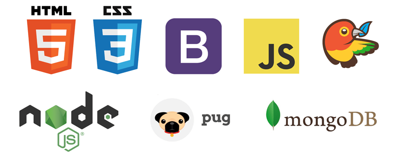

# TØKKES: ***Your home a little bit more secure.***

This repo contains my full-stack project Tøkkes built during the Skylab Bootcamp in Barcelona.

Tøkkes are NFC devices that including NFC tags ready to to some task instantly with your phone without unblock it nor introduce any password or code.

Tøkkes is perfect to add a bit more of security in homes worldwide. Tøkkes is easy, cheap and only need to be configured before starting. This app tries to facilitate this part and boots the purchase of these products.

The main idea of this app is to provide an environment where anyone could set up the NFC tags, and order their own customized Tøkkes.

## Tøkkes app 💛

## Installation 🔥

 We asume we have installed node, mongoDB and nodemon in our computer. Otherwise, install this packages.

https://nodejs.org/es/

https://nodemon.io/

https://www.mongodb.com/

* ### .env file configuration:

You need to create an .env file in the project root with the following environment variables configured:

*Port:* PORT=3000

*Mongodb path and database to use:* DB_URI=mongodb://localhost:27017/\< database_name \>

* ### Run the server:

`npm start`

All dependencies will be installed automatically

* ### API

In order to know  your device NFC compatibility, our app works with **fonoapi**, a API service that offers for free the features from any mobile device, including if they include NFC tehnology. You can see the web and the github repository below this lines:

https://github.com/mtrung/fonoapi

It is necesary a token: \*\*\*\*\*\*\*\*\*\*. you can adquire yours in this url:

https://fonoapi.freshpixl.com/

## Built with: 💻

* SublimeText

### Front-end
* Bootstrap: 3.3.7
* bootstrap 3.3.7
* jquery": 3.2.1
* pug: 2.0.0-rc.2
* first html was custom developed version of Pillar Mediumrere[template](http://madewith.mediumra.re/)

### Back-end
* express: 4.15.3
* express-session: "^1.15.3
* dotenv: 4.0.0
* body-parser: 1.17.2
* bower: 1.8.0
* mongoose: 4.9.0
* body-parser: 1.17.1
* nodemon: 1.11.0
* session-file-store: 1.0.0

## Autor

[José Ángel Barrera](https://github.com/joseangelbarrera)

## Many thanks to

All people I meet (teachers included) in [Skylab Coders Academy](http://www.skylabcoders.com/en)  😀